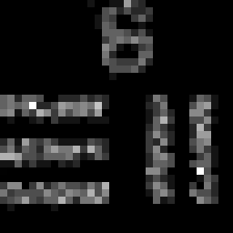
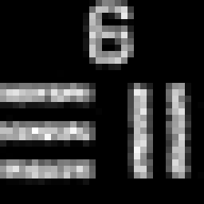
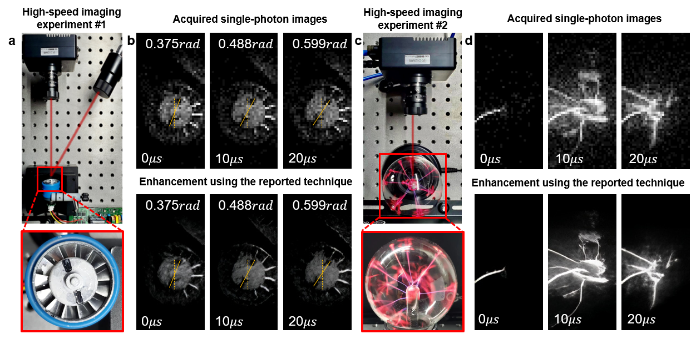

# High-resolution single-photon imaging with physics-informed deep learning


[](https://doi.org/10.5281/zenodo.8260069)

## 1. System requirements
### 1.1 All software dependencies and operating systems
The project has been tested on Windows 10 and Ubuntu 18.04.1 LTS.
### 1.2 Versions the software has been tested on
The project has been tested on Python 3.7 and matlab 2022a.
### 1.3 Any required non standard hardware
There is no non-standard hardware required for this project. 


## 2. Installation guide
### 2.1 Instructions

To install the software, clone the repository and run the following command in the terminal:
```
git clone https://github.com/bianlab/single-photon.git
```
    
### 2.2 Typical install time on a "normal" desk top computer 
The installation time is approximately 1 minute and fluctuates depending on network conditions.

## 3. Demo
### 3.1 Instructions to run on data
#### 3.1.1 How to run the software to synthesize images
To run the software on the data, run the following command in the matlab terminal:
```matlab
cd ./synthesis_images
main.m
```

#### 3.1.2 How to run the software to enhance the SPAD array images
First, follow the requirements in the `requirements.txt` file to build the running environment, and only after the environment is built can you run the SPAD array image enhancement code.
We have provided some test cases in the `testdata` folder, to enhance them, first go to the Gated_Fusion_Transformer directory,
```
cd ./Gated_Fusion_Transformer
```
Next, open the ` test.ipynb`  file using jupyter notebook and run the code line by line. If your environment is installed correctly, the enhanced results will be output in the ` . /testdata/` output folder.
```
source activate <your environment name>
jupyter notebook
```


### 3.2 Expected output

#### 3.2.1 Expected output for the synthesis images 
The synthesis images are saved in the folder 'output/test' as 'xmW_yframes_z.tiff' where x is the power of the laser, y is the number of frames, and z is the number of the image in the sequence. Here are example synthesis images at 20mW, composed of 32 frames and 256 frames respectively:


| Ground truth | Composed of 32 frames at 20mW | Composed of 256 frames at 20mW |
|:---:|:---:|:---:|
|  |  |  |


The output is displayed in the terminal:
```matlab
256 frames, psnr = 15.8988
256 frames, psnr = 18.4644
256 frames, psnr = 20.8186
512 frames, psnr = 16.9459
512 frames, psnr = 20.6258
512 frames, psnr = 22.0559
1000 frames, psnr = 20.0973
1000 frames, psnr = 23.3283
1000 frames, psnr = 24.4419
......
```
where the first number is the number of frames, and the second number is the PSNR value compared to the ground truth.

#### 3.2.2 Expected output for the enhanced SPAD array images
Here, we default you to use anaconda to manage your deep learning environment.
We provide a pre-trained model in the `. /model_zoo/super_resolution/` folder , which is automatically called by the algorithm. After running the code, you will get the enhanced result as shown in the figure below.



### 3.3 Expected run time for demo on a "normal" desktop computer
The estimated time it takes to synthesize an image is typically around 0.5 seconds and can vary depending on the device. The estimated time it takes to enhance an image is typically around 0.2 second and can also vary depending on the device.

## 4. Instructions for use
### 4.1 How to run the software on your data to synthesize images
To synthesize images using your data, please place your respective images inside the 'input' folder.

If you wish to adjust the frames and power settings of the laser, you can modify the code snippet as shown below:
```python
frames_list=[1, 2, 4, 8, 16, 32, 64, 128, 256, 512, 1000];
power_list=[10, 20, 40];
processImage(I[image_index], frames_list, power_list, image_index);
```
In this code:
- `frames_list` represents the different frame options you can choose from.
- `power_list` outlines the available power settings for the laser. 
- `processImage` function will then take these parameters and process the image.

Please note that the array `I` stores the images, and `image_index` is used to select the specific image from this array.
